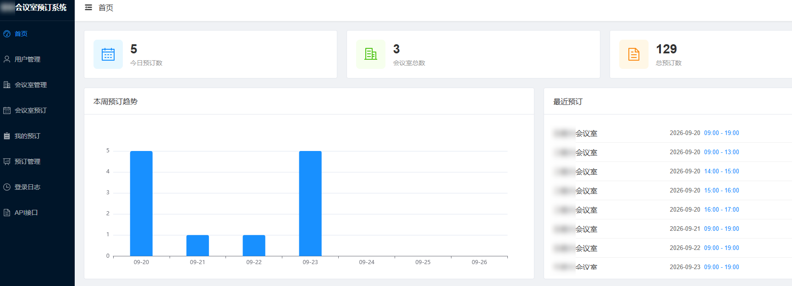
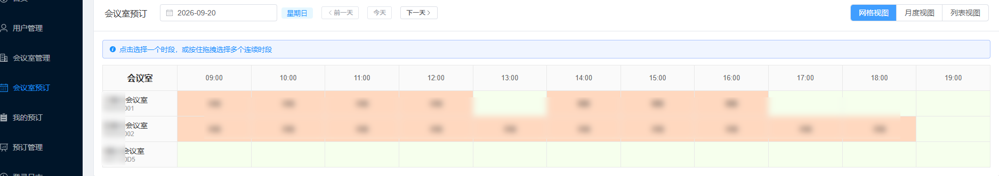
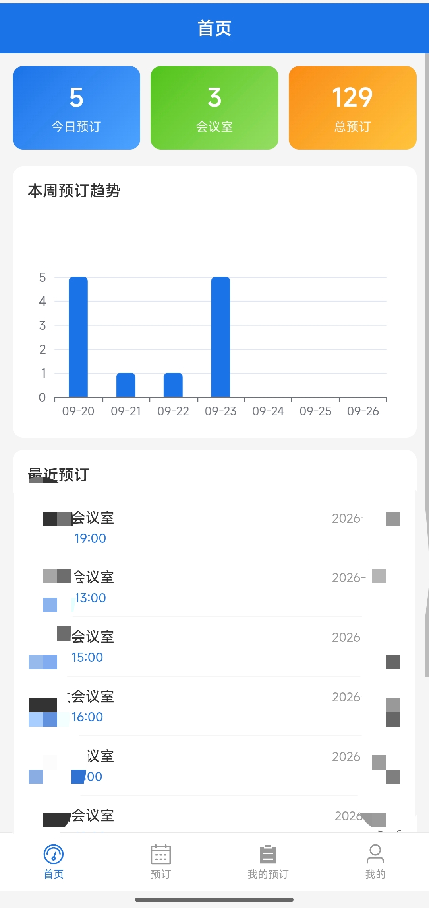
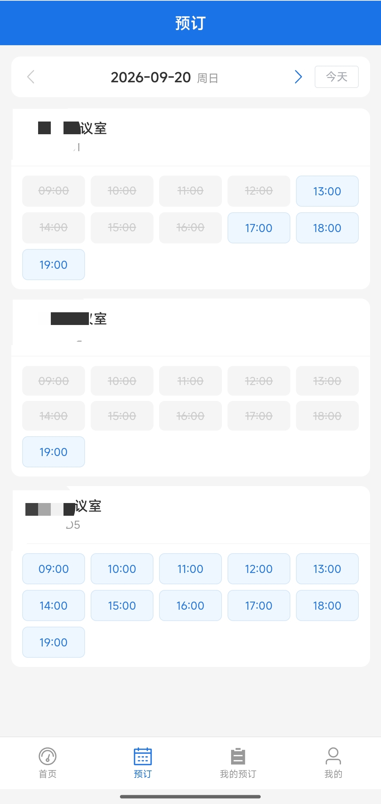

# 会议室预订系统

基于 Flask + Vue 3 的全栈会议室预订系统，支持移动端适配、PWA、MCP（AI Agent）接入。

支持管理员指定固定时间部门周会,批量预订等




## 技术栈

| 层     | 技术                                    |
| ----- | ------------------------------------- |
| 前端    | Vue 3 + Vite + Element Plus + ECharts |
| 后端    | Flask + SQLAlchemy                    |
| 数据库   | SQLite                                |
| 反向代理  | Nginx（Docker 单容器部署）                   |
| AI 接入 | MCP (Streamable HTTP)                 |

## 目录结构

```
meetingRoom/
├── backend/          # Flask 后端
│   ├── app.py        # 入口文件
│   ├── routes/       # API 路由
│   ├── models.py     # 数据模型
│   ├── config.yaml   # 配置文件
│   └── mcp_server.py # MCP 服务端（可选）
├── frontend/         # Vue 3 前端
├── database/         # SQLite 数据库（运行时生成，已 gitignore）
├── uploads/          # 上传文件（已 gitignore）
├── mobile/           # 移动端相关（已 gitignore）
├── Dockerfile        # 多阶段构建 Dockerfile
├── docker-compose.yml
└── nginx.conf        # 容器内 Nginx 配置
```

---

## 一、开发环境运行

### 1. 启动后端（Flask，端口 5000）

```bash
cd backend
pip install -r requirements.txt
python app.py
```

首次运行会：

- 自动创建 SQLite 数据库 `database/meeting_room.db`
- 自动初始化会议室等基础数据
- 生成随机管理员密码并打印到控制台，**请立即登录后修改密码**

### 2. 启动前端（Vite 开发服务器，端口 3000）

```bash
cd frontend
npm install
npm run dev
```

Vite 已将 `/api` 代理到后端（见 `frontend/vite.config.js`，默认 `http://127.0.0.1:5000`）。

开发环境访问：`http://localhost:3000`

### 3.（可选）启动 MCP 服务端（端口 8080）

```bash
cd backend
python mcp_server.py
```

供 AI Agent（OpenCode / Claude Desktop / Cursor 等）通过 MCP 协议操作会议室系统。详见下文「五、MCP 接入」。

---

## 二、前端构建

### 本地构建

```bash
cd frontend
npm install
npm run build
```

构建产物输出到 `frontend/dist/`。

> 注意：生产环境构建时，如果后端不是与前端同源部署（即不是经 Nginx 代理 `/api`），请先修改 `frontend/vite.config.js` 中的代理配置或使用环境变量 `CORS_ORIGINS` 放行前端来源。

---

## 三、Docker 打包与部署

### 1. 构建镜像

```bash
docker build . -t tw/meetingroom
```

多阶段构建：

- 阶段一：`node:18-alpine` 编译前端，输出 `frontend/dist`
- 阶段二：`python:3.11-slim` 安装 Flask 依赖 + Nginx，运行 Flask 与 Nginx

### 2. 保存 / 传输镜像（可选）

```bash
docker save tw/meetingroom > mr.tar
# 拷贝到目标服务器后
docker load < mr.tar
```

### 3. 启动服务

```bash
docker compose up -d
```

`docker-compose.yml` 说明：

- 映射宿主机 `80` 端口 → 容器 `80` 端口
- 挂载 `./database` → 容器 `/app/database`（持久化数据库）
- 挂载 `./backend/uploads` → 容器 `/app/uploads`（持久化上传文件）
- 容器异常退出自动重启

### 4. 查看状态与日志

```bash
docker ps                  # 查看容器状态
docker logs -f meeting-room   # 查看日志（含首次管理员密码）
docker compose down        # 停止服务
```

---

## 四、访问与使用

### 访问地址

| 环境               | 地址                                |
| ---------------- | --------------------------------- |
| 生产（Docker/Nginx） | `http://<服务器IP>/`（80 端口）          |
| 开发（前端）           | `http://localhost:3000`           |
| 后端 API           | `http://<服务器IP>/api/`（经 Nginx 代理） |

### 首次登录

1. 查看容器日志获取初始管理员密码：
   
   ```bash
   docker logs meeting-room | grep "密码"
   ```
2. 使用账号 `admin` + 该密码登录
3. **登录后立即在「个人信息」页面修改密码**

### 功能模块

- **仪表盘**：今日预订、会议室使用统计、最近预订
- **预订管理**：按会议室/日期查询可用时段、发起/取消预订
- **系统预订**：管理员配置按周循环的系统预订
- **用户管理**（管理员）：用户 CRUD、分配管理员权限
- **会议室管理**（管理员）：会议室增删改查
- **个人信息**：修改资料、修改密码、生成/删除 MCP 授权码

### 移动端

浏览器窗口宽度小于 768px 时自动切换为移动端界面（底部 Tab 栏），也支持 PWA 安装到桌面（无需反复登录，10 天内自动登录）。

---

## 五、MCP 接入（AI Agent 操作会议室）

MCP 服务端将会议室系统封装为工具，AI Agent 可通过自然语言查询/预订会议室。

### 1. 启动 MCP 服务端

```bash
cd backend
python mcp_server.py
# 默认监听 0.0.0.0:8080，端点 http://<主机>:8080/mcp
```

### 2. 生成授权码

1. 登录 Web 端
2. 进入「个人信息」页面
3. 点击「生成MCP授权码」，再点「复制授权码」

> 每个用户的授权码不同，绑定其身份和权限。

### 3. 配置 Agent 客户端

将授权码填到各自 Agent 的 MCP 配置中（URL 参数 `?auth_code=xxx`），MCP 服务端会自动识别用户身份，实现多用户隔离、防止越权：

**OpenCode**（`opencode.json` / `~/.config/opencode/opencode.json`）：

```json
{
  "mcp": {
    "会议室-管理员": {
      "type": "remote",
      "url": "http://127.0.0.1:8080/mcp?auth_code=管理员的授权码"
    }
  }
}
```

**Claude Desktop**（`claude_desktop_config.json`）：

```json
{
  "mcpServers": {
    "meeting-room": {
      "url": "http://127.0.0.1:8080/mcp?auth_code=你的授权码"
    }
  }
}
```

### 4. 使用示例

```
用户: 查询今天有哪些会议室可用
用户: 帮我预订 A栋301 会议室，明天下午2点到3点，开项目周会
用户: 查看我当前的预订
用户: 取消预订 123
```

> 详细说明见 `backend/MCP_README.md`。

---

## 六、环境变量与常用配置

| 变量 / 配置                     | 说明             | 默认值                                           |
| --------------------------- | -------------- | --------------------------------------------- |
| `CORS_ORIGINS`              | CORS 白名单（逗号分隔） | `http://localhost:3000,http://localhost:5173` |
| `MEETING_ROOM_API_URL`      | MCP 服务端调用的后端地址 | `http://127.0.0.1:5000`                       |
| `server.port`（config.yaml）  | Flask 端口       | `5000`                                        |
| `jwt.access_token_expires`  | Token 有效期（秒）   | `86400`（24h）                                  |
| `upload.max_content_length` | 上传大小限制         | 后端实际限制 50MB                                   |

---

## 七、常见问题

| 问题           | 处理方式                                           |
| ------------ | ---------------------------------------------- |
| 忘记管理员密码      | 停止服务，删除 `database/meeting_room.db` 后重启（会重新初始化） |
| 数据库/上传目录不存在  | 首次运行自动创建；Docker 部署时确认挂载目录可写                    |
| 修改后端地址       | 开发环境改 `frontend/vite.config.js`；生产环境改 Nginx 配置 |
| 移动端不生效       | 确认浏览器窗口 < 768px，PWA 需使用 HTTPS 或 localhost      |
| MCP 提示未配置授权码 | 在 Agent 配置 URL 中添加 `?auth_code=你的授权码`          |
